# FD-DIT: Frequency Domain-Directed Diffusion Transformer for Low-Dose CT Reconstruction
[](https://arxiv.org/abs/2506.23466)
[](https://opensource.org/licenses/MIT)
This repository contains the PyTorch implementation of the paper **"FD-DIT: Frequency Domain-Directed Diffusion Transformer for Low-Dose CT Reconstruction"**.
> **Code Availability:** The source code is available at [https://github.com/yqx7150/FD-DIT](https://github.com/yqx7150/FD-DIT).

## Abstract
Low-dose computed tomography (LDCT) re-duces radiation exposure but suffers from image artifacts and loss of detail due to quantum and electronic noise, po-tentially impacting diagnostic accuracy.Transformer com-bined with diffusion models has been a promising approach for image generation. Nevertheless, existing methods ex-hibitlimitations in preserving fine-grained image details. To address this issue, frequency domain-directed diffusion transformer(FD-DiT)is proposed for LDCTreconstruc-tion. FD-DiTcenters on a diffusion strategy that progres-sively introduces noise until the distribution statistically aligns with that of LDCT data, followed by denoising pro-cessing. Furthermore, we employ a frequency decoupling technique to concentrate noise primarily in high-frequency domain, thereby facilitating effective capture of essential anatomical structures and fine details. A hybrid denoising network is then utilized to optimize the overall datarecon-struction process. To enhance the capability in recognizing high-frequency noise, we incorporate sliding sparse localat-tention to leverage the sparsity and locality of shallow-layer information, propagating them via skip connections for im-proving feature representation. Finally, we propose a learn-able dynamic fusion strategy for optimal component inte-gration. Experimental results demonstrate that at identical dose levels, LDCT images reconstructed byFD-DiT exhibit superior noise and artifact suppression compared to state-of-the-art methods.

Index Terms—Low-dose CT, diffusion transformer, frequencydomain, sinogram domain,multi-network learning.

## Key Features

* **Generalized Diffusion Strategy:** Perturbs data towards the specific LDCT distribution rather than a random Gaussian distribution, improving feature retention during the reverse process.
* **Frequency-Aware Architecture:** Decomposes sinogram data into frequency subbands (High, Low, Full) via Gaussian filtering to target specific noise characteristics.
* **Sliding Sparse Local Attention (SSLA):** A novel attention mechanism in the FHD module that captures local high-frequency features with reduced computational cost, tailored for sparse and localized noise patterns.
* **Multi-Network Learning:** Synergistically combines the global context capability of Transformers (for high frequencies) with the local inductive bias of CNNs (for low frequencies).
* **Robust Reconstruction:** Integrates Penalized Weighted Least-Squares (PWLS) and Total Variation (TV) regularization during iterative reconstruction to ensure data fidelity.

## Method Overview
<p align="center">
  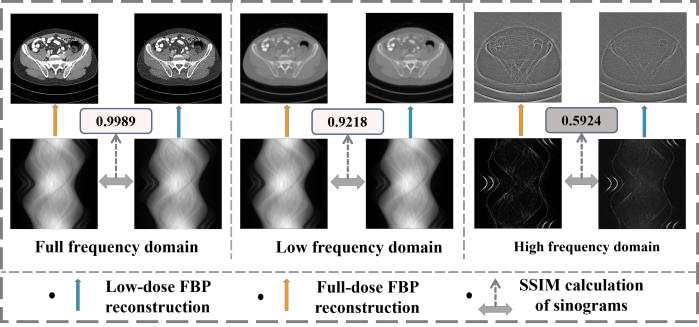
  <br>
  <em>Figure 1: Illustration of the contrast between low-dose and full-dose CT data in different frequency domain. It can be observed that most of the noise is distributed in the high-frequency domain.</em>
</p>

<p align="center">
  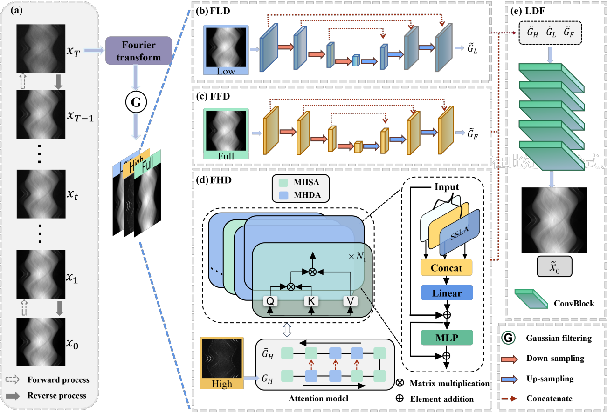
  <br>
  <em>Figure 2: Training process of FD-DiT. (a) Generalized diffusion model incorporating the degradation of NDCT data into LDCT data distribution (b) mitigation of distortion caused by residual low-frequency domain noise, (c) dynamic constraints on the denoising process to balance noise suppression and structural preservation (d) high-frequency denoising module composed of MHDA blocks and MHSA blocks (e) learnable dynamic fusion strategy for optimal cross-frequency fusion.</em>
</p>

<p align="center">
  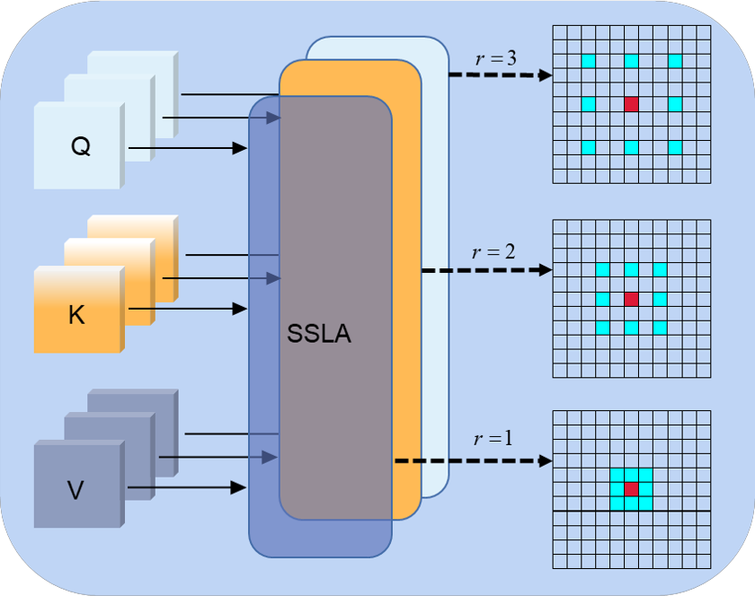
  <br>
  <em>Figure 3: Illustration of sliding sparse local attention (SSLA). SSLA decomposes queries, keys, and values into multi-channel structures, performing local convolution operations within sparse blocks (highlighted in red) around query patches, with distinct dilation rates for diversified receptive fields. By default,the dilation rates are set to 𝑟 = 1, 2, 3, corresponding to receptive field sizes of 3 × 3, 5 × 5, and 7 × 7 for different SSLA modules.</em>
</p>

<p align="center">
  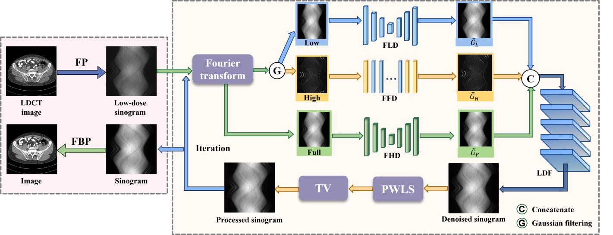
  <br>
  <em>Figure 4: The pipeline for iterative reconstruction stage of FD-DiT. During the reconstruction process, LDCT reconstruction is performed by processing different frequency domains in parallel through multiple modules.</em>
</p>

## Results
<p align="center">
  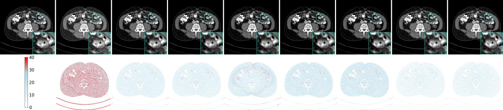
  <br>
  <em>Figure 5: Reconstruction results of AAPM Challenge data with 1e5 photons using different methods. (a) The reference image, (b) FBP (c) RED-CNN (d) WiTUnet (e) DU-GAN (f) U-Vit (g) RAP (h) CoreDiff and (i) FD-DiT. The display window is [-5, 300] HU. The zoomed-in blue ROIs allow clear observation of the noise removal effect</em>
</p>

<p align="center">
  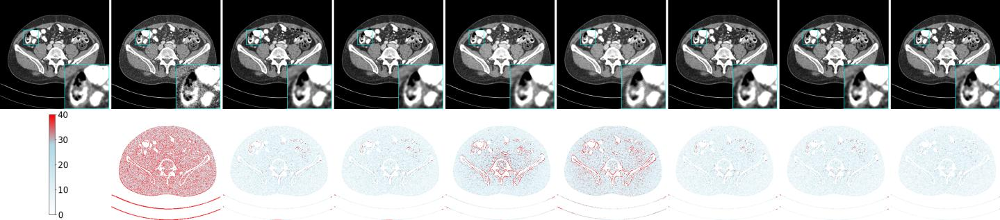
  <br>
  <em>Figure 6:  Reconstruction results of AAPM Challenge data with 5e4 photons using different methods. (a) The reference image, (b) FBP (c) RED-CNN (d) WiTUnet (e) DU-GAN, (f) U-Vit (g) RAP (h) CoreDiff and (i) FD-DiT. The display window is [-5, 300] HU. The zoomed-in blue ROIs allow clear observation of the noise removal effect.</em>
</p>

<p align="center">
  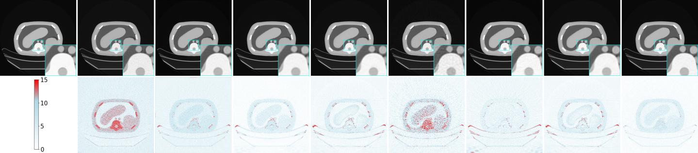
  <br>
  <em>Figure 7: Reconstruction results of CIRS phantom data with 1e5 photons using different methods. (a) The reference image (b) FBP (c) RED-CNN (d) WiTUnet (e) DU-GAN (f) U-Vit (g) RAP (h) CoreDiff and (i) FD-DiT. The display window is [-5, 300] HU. The zoomed-in blue ROIs allow clear observation of the noise removal effect.</em>
</p>

<p align="center">
  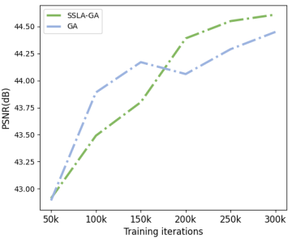
  <br>
  <em>Figure 8: Training efficiencies of distinct components. (a) FFD, FFD+FLD, and FFD+FLD+FHD (b) PWLS+TV (c) SSLA-GA represents the combination of MHDA and MHSA modules, GA consists of only MHSA blocks (d) LDF denotes the fusion of high-frequency and low-frequency through a module, L+H represents the summation of high-frequency and low-frequency</em>
</p>

<p align="center">
  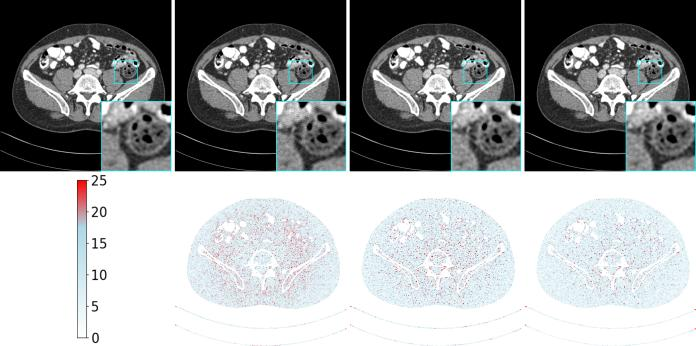
  <br>
  <em>Figure 9: Reconstruction results with 1e5 photons using different structural compositions. (a) The reference image, (b) FFD, (c) FFD-FLD, and (d) FFD FLD-FHD. The display window in the first row is still [-5, 300] HU.</em>
</p>

<p align="center">
  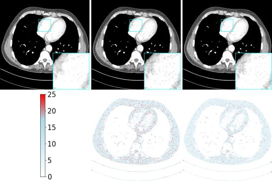
  <br>
  <em>Figure 10: Reconstruction results with 1e5 photons using different attention mechanisms. (a) The reference image, (b) GA, global attention mechanism. (c) SSLA-GA, integrated global-local attention mechanism. The display window in the first row is still [-5, 300] HU</em>
</p>

<p align="center">
  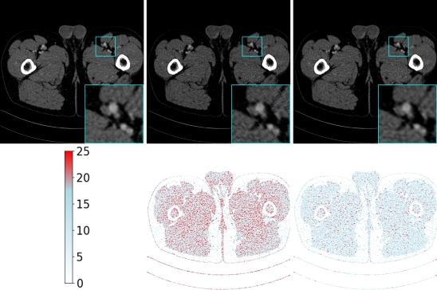
  <br>
  <em>Figure 11:  Reconstruction results with 1e5 photons using different fusion methods. (a) The reference image, (b) L+H, the summation of high-frequency and lowfrequency, (b) LDF. The display window in the first row is still [-5, 300] HU.</em>
</p>


## Citation
```bibtex
If you use this code or find our work useful, please cite:
@article{liu2025fddit,
  title={FD-DIT: Frequency Domain-Directed Diffusion Transformer for Low-Dose CT Reconstruction},
  author={Liu, Qiqing and Wei, Guoquan and Zhou, Zekun and Wen, Yiyang and Shi, Liu and Liu, Qiegen},
  journal={arXiv preprint arXiv:2506.23466},
  year={2025}
}


